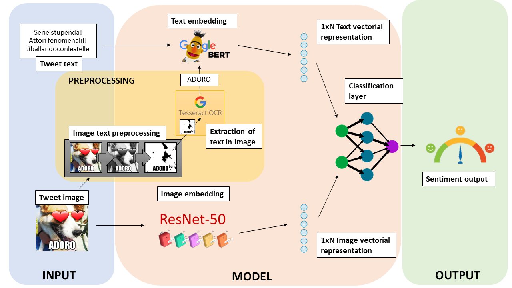

# a MultiModal Approach to Sentiment Analysis for Italian TV Programs Tweets

MmaSAI TVpT is the acronym for Multi-modal approach to Sentiment analysis for Italian TV programs Tweets.
 
This folder contains code to:

- Scrape twitter to collect data based on hashtags
- Generate an interface to label multi-modal data composed by text and image
- Preprocess images and extract text from them using pyTesseract
- Build a Multi-stream neural network for sentiment classification based on:
	- Bert to embed text
	- ResNET50 to embed images
- Demo to test the algorithm
 

